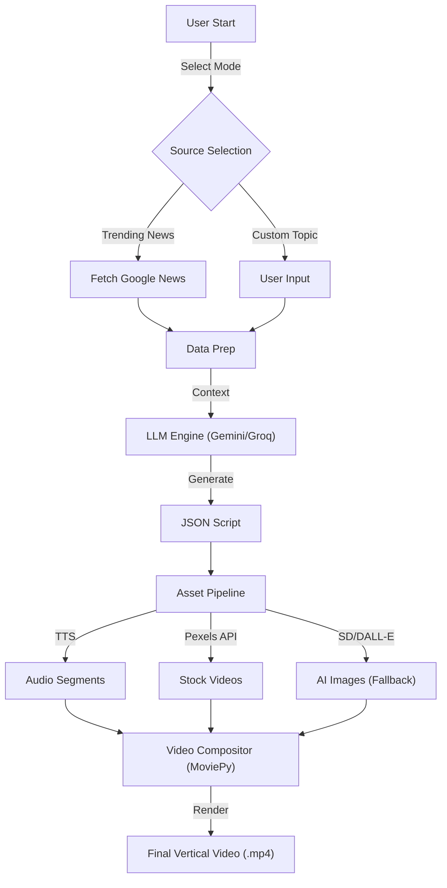
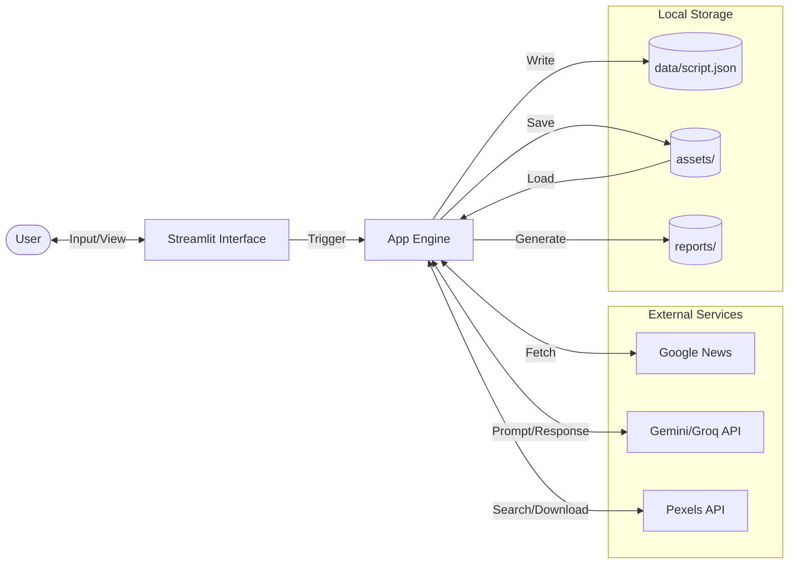

# 🎬 AI Viral Video Studio

**AI Viral Video Studio** is a powerful, automated tool designed to create stunning 9:16 vertical short-form videos from trending news or custom topics. Built with **Streamlit**, it leverages the power of Large Language Models (Gemini/Groq) and stock footage (Pexels) to produce engaging content ready for TikTok, Instagram Reels, and YouTube Shorts.


## 🚀 Features

-   **🤖 Dual AI Engine**: Choose between **Google Gemini 1.5** or **Groq (Llama 3)** for ultra-fast script generation.
-   **📰 Trending News Mode**: Automatically fetches the latest headlines from Google News to generate timely viral content.
-   **🎨 Dynamic Visuals**:
    -   **Real Stock Footage**: Integrates with the **Pexels API** to find relevant high-quality background videos.
    -   **AI Image Generation**: Falls back to AI-generated static visuals if no video is found.
-   **🗣️ Realistic Voiceovers**: Uses **Edge-TTS** to generate high-quality, neural-sounding voiceovers.
-   **🎞️ Automated Editing**: Uses **MoviePy** to stitch together audio, visuals, and dynamic text overlays into a polished video.
-   **☁️ Cloud Ready**: Optimized for deployment on **Streamlit Community Cloud** with secure secrets management.

## 🛠️ Tech Stack

-   **Frontend**: [Streamlit](https://streamlit.io/)
-   **LLM (Scripting)**: `google-generativeai`, `groq`
-   **Video Processing**: `moviepy`, `ffmpeg`
-   **Audio**: `edge-tts`
-   **Assets**: `Pexels API`

## 📦 Installation (Local)

1.  **Clone the Repository**
    ```bash
    git clone https://github.com/DYNOSuprovo/ai-video-studio.git
    cd ai-video-studio
    ```

2.  **Install Dependencies**
    Requires **Python 3.10+**.
    ```bash
    pip install -r requirements.txt
    ```
    *Note: You also need `ffmpeg` installed on your system path.*

3.  **Set Up Environment Keys (Optional for Local)**
    Create a `.env` file in the root directory:
    ```env
    GEMINI_API_KEY=your_gemini_key
    GROQ_API_KEY=your_groq_key
    PEXELS_API_KEY=your_pexels_key
    ```

4.  **Run the App**
    ```bash
    streamlit run app.py
    ```

## ☁️ Deployment (Streamlit Cloud)

This app is optimized for Streamlit Community Cloud.

1.  Push your code to GitHub.
2.  Deploy the app on [share.streamlit.io](https://share.streamlit.io/).
3.  **VITAL:** Go to **App Settings > Secrets** and add your API keys:

    ```toml
    GEMINI_API_KEY = "your_key_here"
    GROQ_API_KEY = "your_key_here"
    PEXELS_API_KEY = "your_key_here"
    ```

## 🏗️ Architecture & Workflow

### Application Flow


### Data Flow Diagram (DFD)


## 📂 Project Structure


```
ai-video-studio/
├── app.py                # Main Streamlit Application
├── src/
│   ├── ingestion.py      # News scraping (Trafilatura/Google News)
│   ├── synthesis.py      # LLM Script Generation (Gemini/Groq)
│   ├── assets.py         # Image gen, Video search (Pexels), Audio (TTS)
│   └── video.py          # Video composition engine (MoviePy)
├── data/                 # Temporary storage for generated scripts
├── assets/               # Generated and downloaded media assets
├── reports/              # Markdown reports of generated videos
├── requirements.txt      # Python dependencies
└── packages.txt          # System dependencies (ffmpeg) for Cloud
```

## 📝 Usage

1.  **Select Source**: Choose "Trending News" to fetch live topics or "Custom Topic" to enter your own.
2.  **Generate**: Click "Generate Video". The app will:
    -   Write a script.
    -   Generate audio for each segment.
    -   Find matching stock videos (or generate images).
    -   Render the final video.
3.  **Download**: Watch the preview and download the final MP4 or the detailed generation report.

## 🛡️ License

This project is open-source and available under the MIT License.
